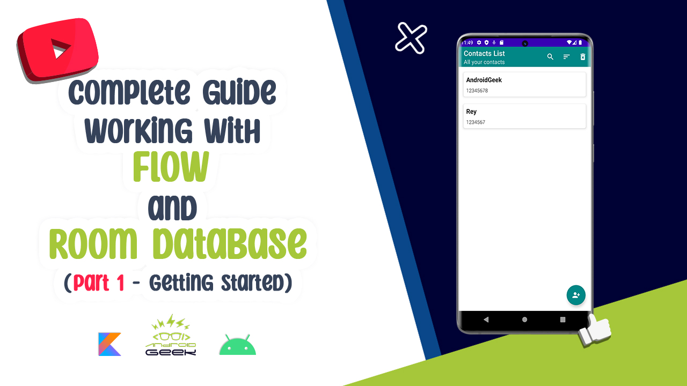

# Flow-Database-Youtube

</a>

Technologies and Libraries Used :
* Clean Articuture (MVVM)
* Coroutines
* Flow
* Room Database
* Dagger Hilt
* View Binding
* Live Data
* RecyclerView Decorator
* DataStatus
* RecyclerView Swipe
* Dialog Fragment

 
YouTube Video 
  
Part 1 :
  

  
Part 2 :
  

 

Screen-Shot :
 

 
 

Article on Medium:
 
https://androidgeek.co/how-to-use-flow-with-room-database-complete-guide-part1-fd7fa0a5b2c1
 
 

✨ Join Medium to read thousands of valuable stories ✨
 
https://medium.com/@ezatpanah/membership
