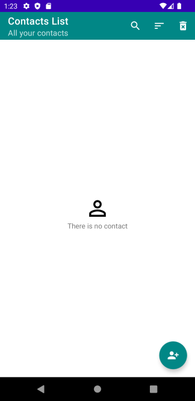
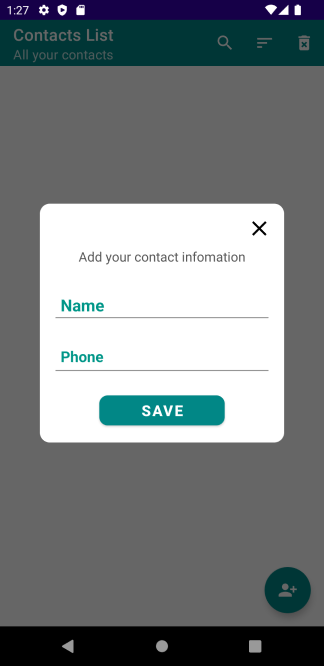
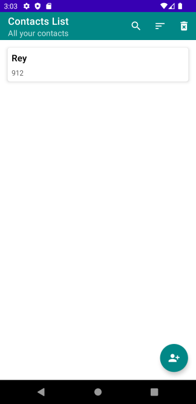
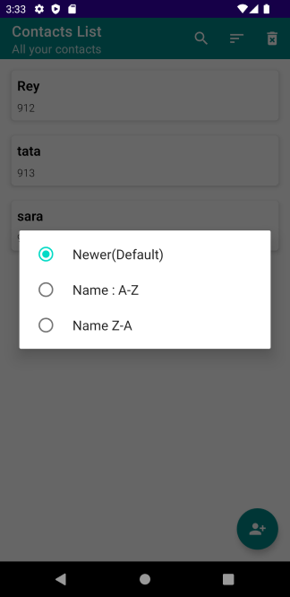
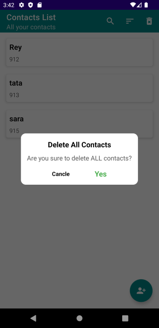
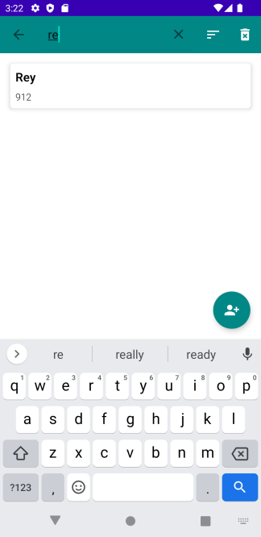
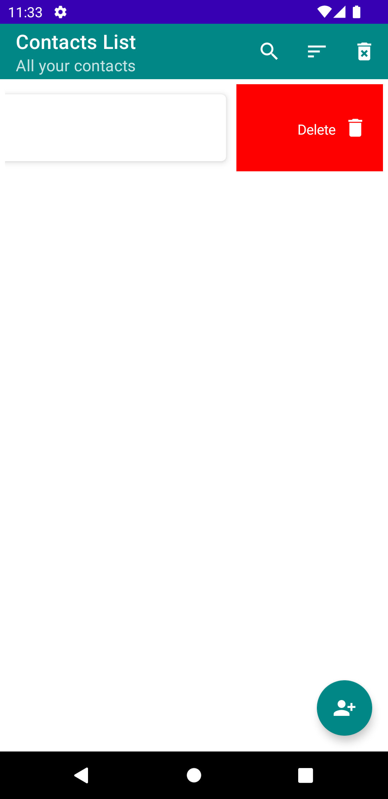
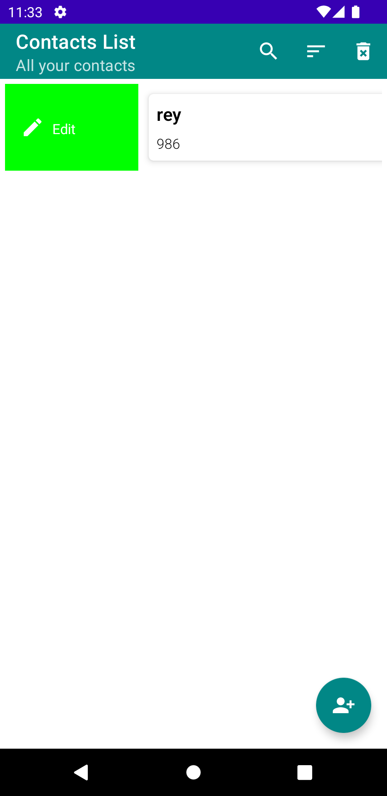

# Flow-Database-Youtube

</a>

Screen-Shot :
 

YouTube Video 
  
   
 

Article on Medium:
 

✨ Join Medium to read thousands of valuable stories ✨
 
https://medium.com/@ezatpanah/membership
