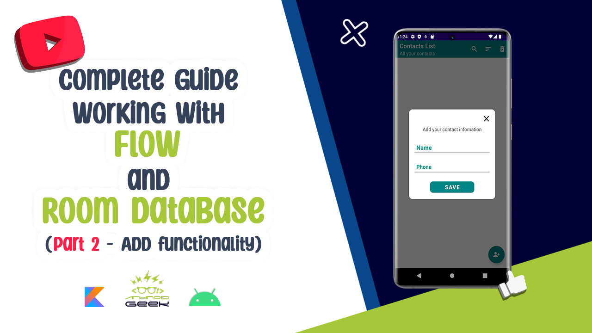
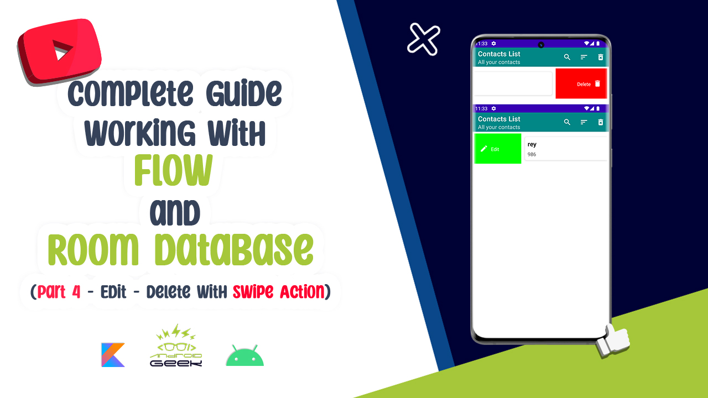

## Flow Database Youtube

- Read the [Article](https://androidgeek.co/how-to-use-flow-with-room-database-complete-guide-part1-fd7fa0a5b2c1) of this project on Medium
- Join my [Medium](https://medium.com/@ezatpanah/membership) to read valuable stories ✨

### 📱 Technologies and Libraries Used 
* Clean Architecture (MVVM)
* Coroutines
* Flow
* Room Database
* Dagger Hilt
* View Binding
* Live Data
* DataStatus
* RecyclerView Swipe
* Dialog Fragment

 

### 📱Video Links

|||||
|--|--|--|--|
|**Video Part1**|**Video Part2**|**Video Part3**|**Video Part4**|
|||||

 

